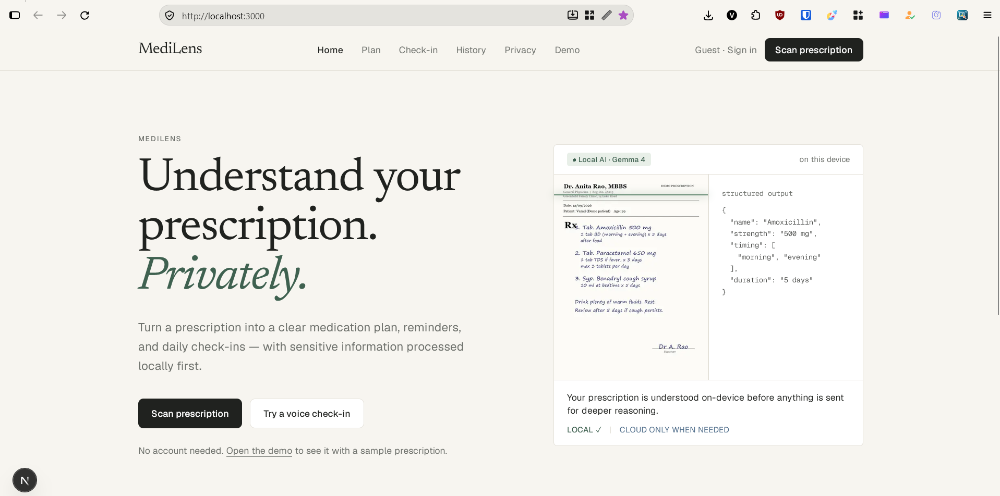
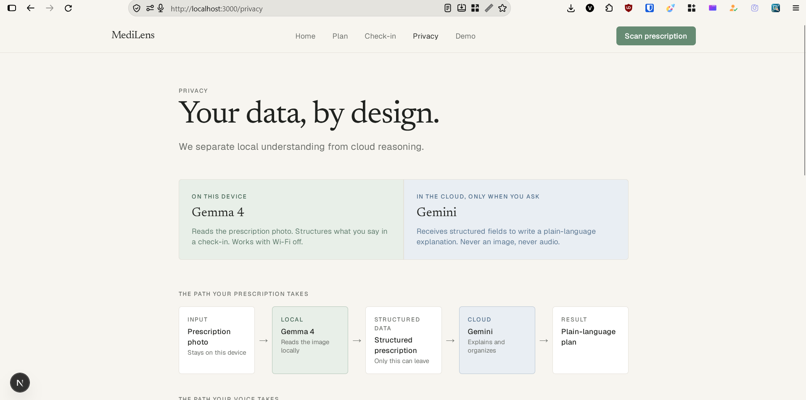
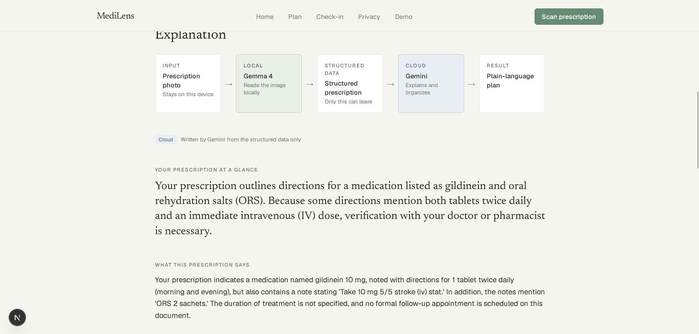
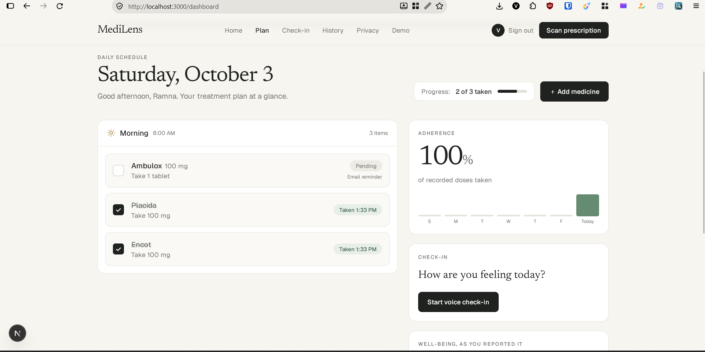

# MediLens

> Understand your prescription. Privately.

MediLens is a local-first medication companion that turns a prescription photo into a structured treatment plan, daily reminders, adherence tracking, and patient-reported check-ins. It is designed to make prescriptions easier to understand without sending raw medical images or voice recordings to a cloud AI service.

**Important:** MediLens needs a local AI runtime and model to perform prescription scanning and check-in structuring. You must have **Ollama running locally with `gemma4-e2b-it-q8-vision` installed**. The app cannot scan prescriptions or structure check-ins without this local model.

## What problem does MediLens solve?

Prescriptions are often difficult to read and easy to forget. Patients may have to interpret abbreviations, remember several doses at different times, and explain changes in symptoms at a follow-up appointment. Sensitive prescription photos and health-related voice notes also should not need to leave the patient's device just to be organized.

MediLens addresses this by:

- Reading a prescription photo and extracting medicines, strengths, dosage, timing, duration, and instructions.
- Converting extracted information into a clear daily medication plan.
- Tracking taken, missed, and skipped doses.
- Letting patients record a natural-language or voice check-in about how they feel.
- Structuring symptoms, wellbeing, progress, and missed doses locally.
- Keeping raw prescription images and voice recordings local.
- Sending only structured prescription fields to Gemini, and only when a plain-language explanation is requested.

MediLens does **not** diagnose, prescribe, or change a clinician's treatment. Users should verify unclear information with a doctor or pharmacist.

## Screenshots

### 1. Local-first prescription understanding



### 2. Privacy-aware AI pipeline



### 3. Plain-language prescription explanation



### 4. Daily medication plan and adherence



## How the app works

### Prescription flow

1. The user uploads or captures a prescription image in **Scan prescription**.
2. The browser downsizes the image before sending it to the local Next.js server.
3. The server sends the image to **Ollama** running on the same machine.
4. `gemma4-e2b-it-q8-vision` reads the image and returns structured JSON constrained by a Zod schema.
5. MediLens validates the extraction and displays the medicines, dosage, frequency, timing, confidence, and uncertain fields.
6. The structured result becomes the user's medication plan and schedule.
7. If the user asks for an explanation, only structured fields are sent to **Gemini**. The original image, patient name, and raw image data are not sent.
8. The user can review the explanation, questions for their clinician, medical terms, and follow-up reminders.

### Daily check-in flow

1. The user records a voice check-in or types their update.
2. Voice is transcribed in the browser using a local Whisper model. The raw recording is not uploaded.
3. The transcript is sent to local Ollama and Gemma structures only what the user explicitly reported.
4. Structured check-in data is stored with the user's history.
5. The dashboard can show wellbeing, symptoms, progress, missed doses, and adherence.
6. Gemini can optionally summarize structured check-in history. This is cloud reasoning over structured data, not raw audio.

### Privacy boundary

```text
Prescription photo ──> Ollama + Gemma 4 locally ──> Structured prescription
                                                               │
                                                               └──> Gemini only when explanation is requested

Voice recording ──> Browser Whisper locally ──> Transcript ──> Ollama + Gemma 4 locally
```

| Data | Where it is processed |
| --- | --- |
| Raw prescription image | Local Ollama/Gemma model; not stored |
| Raw voice recording | Browser; deleted when the page closes |
| Prescription extraction | Local Gemma model, then local validation |
| Structured prescription explanation | Optional Gemini request |
| Patient name | Kept local and removed from the Gemini payload |
| Check-in transcript and structured check-in | App storage/database according to the configured deployment |

## Required local Gemma model

Install **this exact model** in Ollama:

```text
gemma4-e2b-it-q8-vision
```

This is the instruction-tuned, vision-capable Gemma 4 E2B Q8 model expected by the application. The base Gemma GGUF without `-it` cannot reliably follow the extraction instructions, and a text-only model cannot read prescription images.

### Install and run Ollama

1. Install Ollama from [ollama.com](https://ollama.com).
2. Start the Ollama service.
3. Pull the required model:

   ```bash
   ollama pull gemma4-e2b-it-q8-vision
   ```

4. Confirm that Ollama can see the model:

   ```bash
   ollama list
   ```

5. Keep Ollama running while using MediLens. The default endpoint is:

   ```text
   http://localhost:11434
   ```

You can override the endpoint or model with `OLLAMA_BASE_URL` and `OLLAMA_MODEL`, but the configured model must support vision for prescription scanning.

## Tech stack

<p>
  
  
  
  
  
  
  
  
  
  
</p>

- **Next.js 16 App Router** for the web app and server API routes.
- **React 19** and **TypeScript** for the UI and type-safe application code.
- **Tailwind CSS 4** for styling.
- **Ollama + Gemma 4** for local image understanding and local check-in structuring.
- **Transformers.js / Whisper** for in-browser speech-to-text.
- **Google Gemini** for optional explanations and progress summaries from structured data.
- **PostgreSQL on Neon + Drizzle ORM** for server-side persistence.
- **JWT authentication** for account sessions.
- **Resend** for optional medication reminder emails.
- **Zod** for validating model output and API payloads.
- **Recharts** for adherence and symptom visualizations.

## Getting started

### Prerequisites

- Node.js 20 or newer
- npm
- Ollama installed and running
- `gemma4-e2b-it-q8-vision` pulled into Ollama
- A PostgreSQL/Neon database for persistence
- A Gemini API key if you want cloud-generated explanations

### 1. Install dependencies

```bash
npm install
```

### 2. Configure environment variables

Copy `.env.example` to `.env.local` and fill in the values you need:

```bash
copy .env.example .env.local
```

On macOS/Linux:

```bash
cp .env.example .env.local
```

At minimum, configure the local model and authentication secret:

```env
OLLAMA_BASE_URL=http://localhost:11434
OLLAMA_MODEL=gemma4-e2b-it-q8-vision
AUTH_SECRET=replace-with-a-long-random-secret
NEXT_PUBLIC_APP_URL=http://localhost:3000
```

For the complete experience, also configure:

```env
DATABASE_URL=your-neon-postgres-connection-string
GEMINI_API_KEY=your-gemini-api-key
GEMINI_MODEL=gemini-3.8-flash
RESEND_API_KEY=your-resend-api-key
RESEND_FROM_EMAIL=you@example.com
REMINDER_TO_EMAIL=recipient@example.com
```

`GEMINI_API_KEY_2`, `GEMINI_API_KEY_3`, and `GEMINI_API_KEY_4` are optional fallback keys. Hugging Face variables are also optional; browser-based Whisper is the default check-in transcription path.

### 3. Prepare the database

Generate and apply Drizzle migrations:

```bash
npm run db:generate
npm run db:migrate
```

For local development, you can also push the schema directly:

```bash
npm run db:push
```

### 4. Start the development server

Make sure Ollama is running first, then start Next.js:

```bash
npm run dev
```

Open [http://localhost:3000](http://localhost:3000).

## Available routes

| Route | Purpose |
| --- | --- |
| `/` | Product introduction and local-first overview |
| `/scan` | Upload or capture a prescription |
| `/prescription` | Review extracted prescription data and explanation |
| `/dashboard` | View today's medication schedule, adherence, and check-in summaries |
| `/check-in` | Record or type a daily patient check-in |
| `/history` | Review previous prescriptions and check-ins |
| `/privacy` | Inspect the local/cloud AI boundary and payload |
| `/demo` | Try the app with the bundled sample prescription |
| `/auth` | Sign up, sign in, and manage the local app session |

## API overview

| Endpoint | Responsibility |
| --- | --- |
| `POST /api/prescription` | Analyze a prescription image with local Ollama/Gemma |
| `POST /api/checkin` | Structure a transcript with local Ollama/Gemma |
| `POST /api/explain` | Generate an explanation from structured data with Gemini |
| `POST /api/progress` | Summarize structured check-in history with Gemini |
| `POST /api/state` | Persist prescription and check-in state |
| `POST /api/reminders` | Configure reminder emails |
| `GET /api/health` | Check local Ollama, model, and email availability |
| `/api/auth/[action]` | Handle authentication actions |

## Useful commands

```bash
npm run dev          # Start the development server
npm run build        # Create a production build
npm run start        # Run the production build
npm run lint         # Run ESLint
npm run db:generate  # Generate Drizzle migrations
npm run db:migrate   # Apply migrations
npm run db:push      # Push the schema directly
npm run db:studio    # Open Drizzle Studio
```

## Troubleshooting

### “Local AI is unavailable”

Confirm that Ollama is running and reachable at `OLLAMA_BASE_URL`:

```bash
ollama list
```

Then verify that the exact model name is installed:

```bash
ollama pull gemma4-e2b-it-q8-vision
```

Restart the Next.js server after changing `.env.local`.

### “Model is not installed in Ollama”

The model name must match exactly:

```env
OLLAMA_MODEL=gemma4-e2b-it-q8-vision
```

Do not use a text-only Gemma model for prescription scanning.

### The explanation is unavailable

Prescription extraction, the medication plan, adherence tracking, and local check-ins can work without Gemini. Add a valid `GEMINI_API_KEY` only when you want the optional plain-language explanation or cloud progress summary.

### Voice check-in does not start

Allow microphone access in the browser. The first check-in may download the browser Whisper model; keep the page open until the one-time model download completes. Users can also type a check-in instead.

## Safety and privacy note

MediLens is an organization and explanation aid, not a medical decision-maker. It does not diagnose conditions, prescribe medication, or alter a clinician's instructions. Model output can be wrong, especially when a prescription is blurry or incomplete. Always verify uncertain fields, doses, and changes with a qualified clinician or pharmacist.

The local-first design reduces exposure of sensitive inputs, but anyone deploying MediLens should still secure their database, environment variables, authentication secret, email provider, and hosting environment.


### Made with ❤️ by Varad and Aman (Team Kernal hackers)
